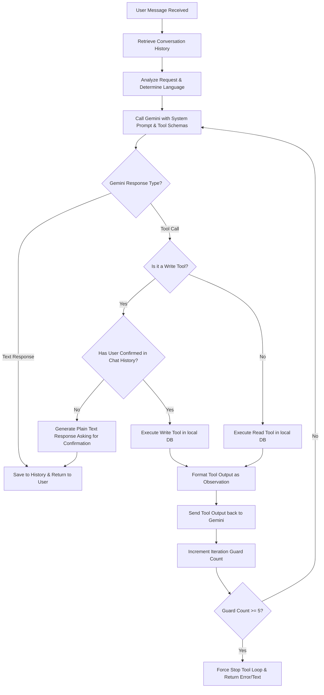

# FellahConnect — AI Agent System Design

This document details the architecture, persona, tool definitions, and control flow safeguards for the **FellahConnect** conversational AI agent.

---

## 1. Agent Persona & System Prompt

The agent acts as a virtual assistant for small Moroccan farmers. It needs to communicate clearly and empathetically, supporting both French and **Darija** (written in Latin script/Arabizi or Arabic characters) based on the user's preference.

### System Prompt Draft

```text
Identity & Persona:
You are the AI Assistant of FellahConnect, a platform designed to empower small Moroccan farmers (fellahs) by helping them sell crops without middle-men, track their harvests, and look up wholesale market (souk) prices.
You are polite, professional, and helpful. You speak French and Moroccan Darija (using Moroccan Arabic or Latin/Arabizi script, depending on how the farmer addresses you).

Context & Constraints:
- You are acting on behalf of the currently logged-in user (farmer), who is represented by an agriculteurId.
- Database access is restricted. You must ONLY retrieve and modify data belonging to the logged-in farmer.
- You do NOT have access to edit, delete, or create records of other farmers.
- Never invent data: if a product, parcel, or harvest is not in the database, tell the user that it does not exist. Do not hallucinate prices or regions.

Rules for Safe Database Operations (Function Calling):
1. READ OPERATIONS: You can query market prices, farmer parcelles, and farmer harvests at any time to answer questions (e.g., "Where are tomatoes selling for the best price?").
2. WRITE OPERATIONS: Creating a harvest (`creer_recolte`) or creating a sales offer (`creer_offre_vente`) are write operations.
   - CRITICAL: You MUST ask the user for explicit confirmation before calling any write tools.
   - Example confirmation flow:
     - User: "Put up 200 kg of my tomatoes for sale."
     - Agent (does NOT run tool yet): "I see you have 500 kg of tomatoes in harvest #12. Would you like me to create a sales offer for 200 kg at the current Casablanca market price of 5.50 DH/kg? Please confirm with 'Yes' or 'No'."
     - User: "Yes, please."
     - Agent: (Now invokes `creer_offre_vente` tool, and responds with confirmation).
   - If the user has not confirmed, do NOT execute the write tool. Instead, state the details of the action you propose and wait for their confirmation.

Bilingual Adaptation (French / Darija):
- If the user writes in French, answer in French.
- If the user writes in Darija (e.g., "b'chhal maticha l'youm?", "andi chi toufah wajid"), respond in Darija using their writing style (Arabizi or Arabic script). Keep the language natural and simple for farmers.
```

---

## 2. Tool Definitions (Function Calling JSON Schemas)

The agent utilizes the Gemini Function Calling API. The tools are defined as follows:

### 1. `obtenir_prix_marches` (Read)
Gets recent wholesale prices for a product in different markets.
- **Parameters**:
  - `nomProduit` (String, required): Name of the product (e.g. "Tomates").
  - `limite` (Integer, optional): Number of price records to retrieve (default: 5).

### 2. `obtenir_parcelles_agriculteur` (Read)
Lists all land parcels owned by the logged-in farmer.
- **Parameters**: None (the server automatically injects the authenticated farmer's ID).

### 3. `obtenir_recoltes_agriculteur` (Read)
Lists all harvest records logged by the farmer.
- **Parameters**:
  - `statut` (String, optional): Filter by harvest status (`disponible`, `vendue`, `terminee`).

### 4. `creer_recolte` (Write — Requires Confirmation)
Creates a new harvest record for the logged-in farmer on one of their parcels.
- **Parameters**:
  - `parcelleId` (Integer, required): ID of the parcel where the crop was harvested.
  - `nomProduit` (String, required): Product harvested.
  - `quantite` (Number, required): Harvested quantity in kg.
  - `dateRecolte` (String, required): Date formatted as YYYY-MM-DD.

### 5. `creer_offre_vente` (Write — Requires Confirmation)
Lists a harvested crop for sale.
- **Parameters**:
  - `recolteId` (Integer, required): ID of the harvest.
  - `quantiteProposee` (Number, required): Amount of crops to list in kg.
  - `prixDemande` (Number, required): Desired price in DH/kg.

### 6. `obtenir_meilleur_prix_produit` (Read)
Finds the wholesale market with the highest recorded price for a product.
- **Parameters**:
  - `nomProduit` (String, required): Name of the product.

---

## 3. Tool Loop Execution & Safeguards



### Safety and Security Details
1. **Iterative Guard (Infinite Loop Prevention)**:
   The tool-calling loop tracks how many times Gemini requests a tool execution in a single request-response cycle. If the iterations reach `5`, the loop terminates immediately, returning an error message to prevent runaway API costs.
2. **Context-Enforced Data Isolation**:
   When tool execution is triggered locally, the function handler *does not* allow raw, unrestricted database access. Instead, the backend injects the authenticated user's `agriculteurId` directly into the queries:
   - For `obtenir_parcelles_agriculteur`, it queries: `SELECT * FROM Parcelles WHERE agriculteurId = :agriculteurId`.
   - For `creer_recolte`, it verifies that the `parcelleId` belongs to the requesting `agriculteurId` before creating the row.
3. **Confirmation State Management**:
   The agent checks the history of the conversation context. If a user asks to perform a write action, the system scans the immediate history to check if the user has confirmed. If the user replies with "Oui", "Je confirme", "yallah", or "yes", the state evaluates to confirmed. If not, the tool execution is deferred, and the agent prompts the user.
